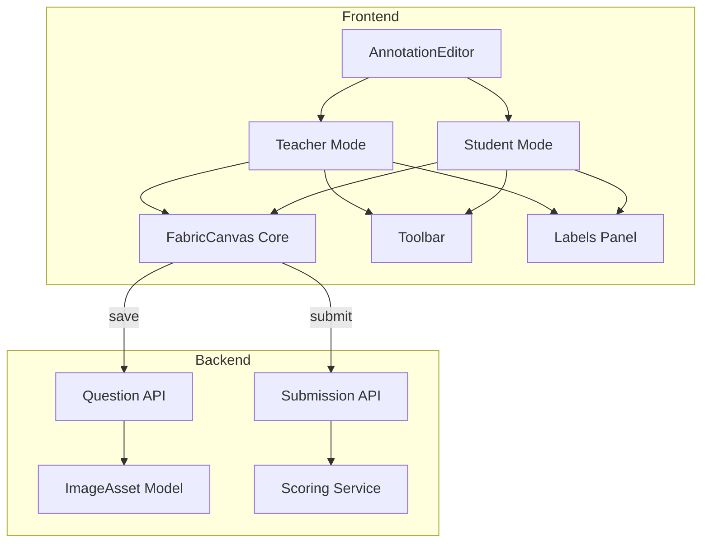

# План реализации редактора аннотаций изображений

## Архитектура решения



## Структура данных аннотаций (COCO-like)

```typescript
interface AnnotationData {
  labels: AnnotationLabel[]        // Метки структур
  annotations: Annotation[]        // Сами аннотации
}

interface AnnotationLabel {
  id: string
  name: string                     // "Stratum corneum"
  color: string                    // "#FF5733"
}

interface Annotation {
  id: string
  label_id: string                 // Связь с меткой
  type: 'polygon' | 'rectangle' | 'ellipse' | 'point'
  points: number[]                 // [x1,y1,x2,y2,...] для polygon/polyline
  bbox?: [number, number, number, number]  // [x,y,w,h] для rect
  center?: [number, number]        // [cx,cy] для ellipse/point
  radius?: [number, number]        // [rx,ry] для ellipse
}
```

## Ключевые файлы

### Backend

- [`backend/app/models/question.py`](backend/app/models/question.py) - уже есть `coco_annotations` в ImageAsset
- [`backend/app/schemas/question.py`](backend/app/schemas/question.py) - расширить схемы для аннотаций
- [`backend/app/api/v1/questions.py`](backend/app/api/v1/questions.py) - эндпоинты сохранения аннотаций
- `backend/app/services/scoring.py` - новый сервис сравнения аннотаций (IoU)

### Frontend

- `frontend/src/components/annotation/AnnotationEditor.tsx` - главный компонент
- `frontend/src/components/annotation/FabricCanvas.tsx` - canvas на fabric.js
- `frontend/src/components/annotation/Toolbar.tsx` - панель инструментов
- `frontend/src/components/annotation/LabelsPanel.tsx` - панель меток слева
- `frontend/src/components/annotation/hooks/useAnnotationStore.ts` - zustand store
- `frontend/src/types/annotation.ts` - типы

---

## Этапы реализации

### 1. Backend: Схемы и API аннотаций

- Добавить Pydantic схемы для `AnnotationLabel`, `Annotation`, `AnnotationData`
- Эндпоинт `PUT /questions/{id}/annotations` для сохранения эталонных аннотаций
- Эндпоинт `GET /questions/{id}/labels` для получения меток (студенту)

### 2. Frontend: Canvas Core (fabric.js)

- Компонент `FabricCanvas` с инициализацией canvas
- Загрузка изображения из presigned URL
- Zoom (колесико + кнопки) и Pan (средняя кнопка / режим руки)
- Координатная система с учетом масштаба

### 3. Frontend: Инструменты рисования

- **Polygon**: клик по точкам, двойной клик завершает
- **Rectangle**: drag для создания
- **Ellipse**: drag для создания
- **Point**: клик для создания
- **Select**: выделение и редактирование существующих
- **Eraser**: удаление выделенного

### 4. Frontend: Панель меток (LabelsPanel)

- Список меток с цветными маркерами
- CRUD меток (название + цвет)
- Выбор активной метки для рисования
- Подсветка аннотаций при hover на метке

### 5. Frontend: Режим преподавателя

- Полный редактор: создание меток + эталонных аннотаций
- Интеграция в [`QuestionFormDialog.tsx`](frontend/src/components/questions/QuestionFormDialog.tsx)
- Сохранение в `reference_data` вопроса

### 6. Frontend: Режим студента

- Только рисование (метки readonly, заданы преподавателем)
- Интеграция в страницу прохождения теста
- Сохранение в submission

### 7. Backend: Сервис оценки (Scoring)

- Расчет IoU (Intersection over Union) между эталоном и ответом
- Учет правильности назначения меток
- Формирование отчета с визуализацией ошибок