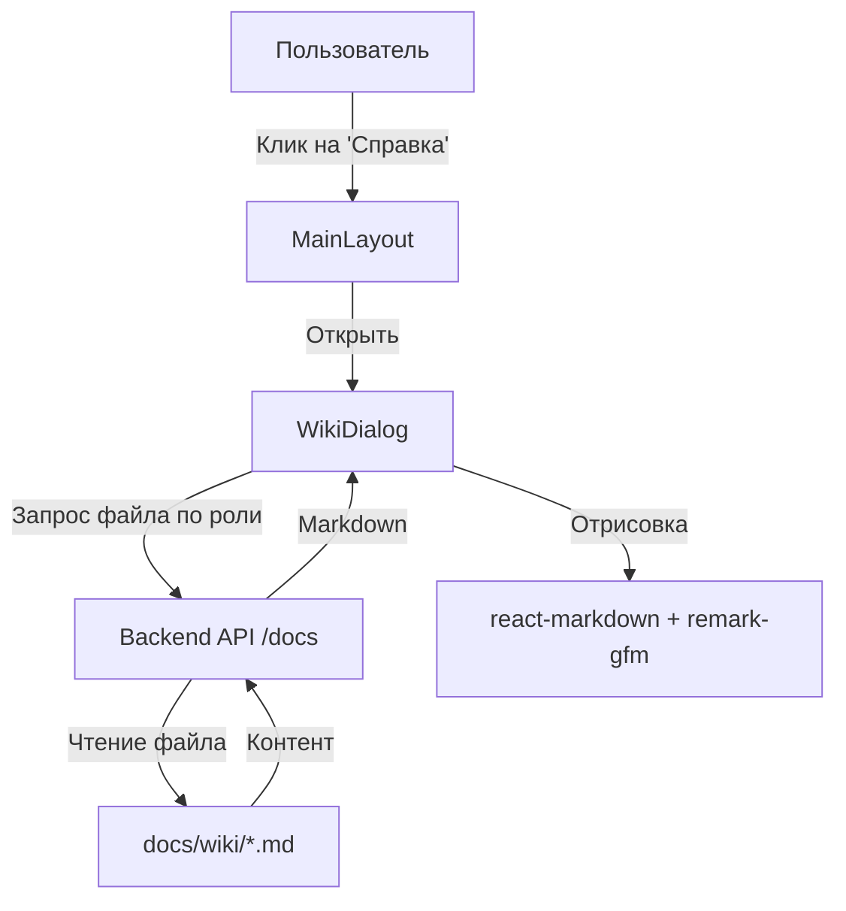

Я реализую систему просмотра документации внутри приложения. Справка будет открываться в диалоговом окне и автоматически подстраиваться под роль текущего пользователя.

### 1. Backend: API для получения документации

Я создам новый эндпоинт в API, который будет безопасно отдавать содержимое `.md` файлов из папки `docs/wiki/` в корне проекта.

- **Новый файл**: [`backend/app/api/v1/docs.py`](backend/app/api/v1/docs.py)
- **Роут**: `GET /api/v1/docs/{filename}`
- **Безопасность**: проверка на выход за пределы директории (`../`) и фильтрация доступных файлов по ролям:
  - **Студент**: `StudentGuide.md`, `ScoringMethodology.md`, `FAQ.md`.
  - **Преподаватель**: Все, кроме `AdminGuide.md`.
  - **Администратор**: Все файлы.
- **Интеграция**: подключение роутера в [`backend/app/api/v1/__init__.py`](backend/app/api/v1/__init__.py).

### 2. Frontend: Зависимости и компоненты

- **Установка**: `npm install react-markdown remark-gfm` в папке `frontend`.
- **Новый компонент**: `frontend/src/components/docs/WikiDialog.tsx`.
  - Использует `react-markdown` для отрисовки текста.
  - Использует `remark-gfm` для поддержки таблиц и списков.
  - Содержит боковую панель или список вкладок для переключения между доступными разделами справки.
  - Обрабатывает клики по внутренним ссылкам (например, [`Roles.md`](Roles.md)), чтобы навигация происходила внутри диалога.

### 3. Интеграция в интерфейс

- **Файл**: [`frontend/src/layouts/MainLayout.tsx`](frontend/src/layouts/MainLayout.tsx)
- **Изменения**:
  - Добавление иконки `HelpOutline` (или аналогичной) в `AppBar` рядом с переключателем языка.
  - Логика открытия `WikiDialog`.
  - При открытии диалога по умолчанию будет загружаться основной гид для текущей роли пользователя.

### Схема взаимодействия:

