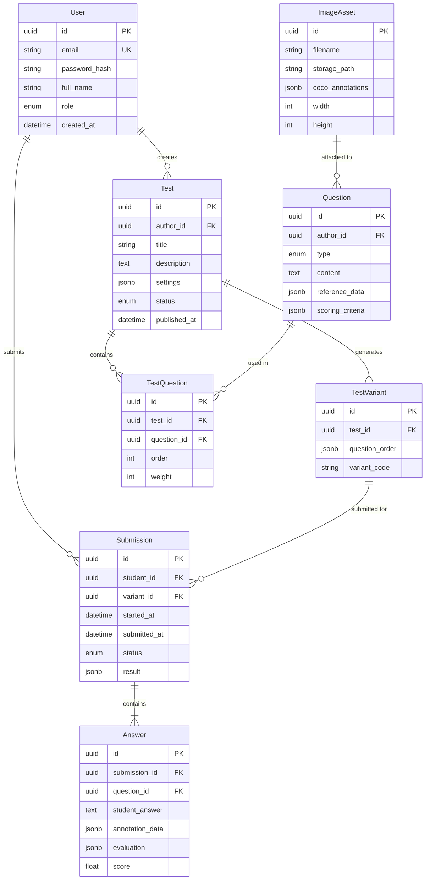

# Архитектурный план MedTest Platform

## 1. Обзор архитектуры

### 1.1 Общая архитектура: Модульный монолит

**Обоснование выбора монолита:**

- Масштаб 500-2000 студентов не требует микросервисной сложности
- Упрощенный deployment на on-premise инфраструктуре
- Меньше overhead на межсервисную коммуникацию
- Проще debugging и monitoring
- Возможность миграции к микросервисам в будущем через модульную структуру

**Ключевые архитектурные слои:**

```javascript
┌─────────────────────────────────────────────────┐
│           Frontend (React + TypeScript)          │
│  - Admin Dashboard  - Teacher Portal  - Student │
└─────────────────────────────────────────────────┘
                      ↓ REST API
┌─────────────────────────────────────────────────┐
│          Backend (FastAPI + Python 3.11+)        │
│  ┌──────────┬──────────┬────────────┬─────────┐ │
│  │   Auth   │   Core   │    LLM     │   CV    │ │
│  │  Module  │  Module  │   Module   │ Module  │ │
│  └──────────┴──────────┴────────────┴─────────┘ │
└─────────────────────────────────────────────────┘
       ↓              ↓              ↓
┌─────────────┐ ┌──────────┐ ┌─────────────────┐
│ PostgreSQL  │ │  Redis   │ │ S3-compatible   │
│   (БД)      │ │  (Cache) │ │ Storage (MinIO) │
└─────────────┘ └──────────┘ └─────────────────┘
```


### 1.2 Точки масштабирования

- **Горизонтальное**: Несколько инстансов backend за Nginx/HAProxy
- **Кэширование**: Redis для сессий, результатов LLM, метаданных
- **Асинхронная обработка**: Celery + Redis для тяжелых задач (LLM, CV)
- **Файловое хранилище**: MinIO в кластерном режиме
- **БД**: PostgreSQL с read replicas для аналитики

---

## 2. Backend: Python-стек

### 2.1 Технологический стек

**Основной фреймворк: FastAPIОбоснование:**

- Современный async/await support (критично для LLM и CV задач)
- Встроенная валидация через Pydantic
- Автогенерация OpenAPI документации
- Высокая производительность (сравнима с NodeJS/Go)
- Отличная типизация (Python 3.11+)

**Ключевые библиотеки:**| Назначение | Библиотека | Версия ||------------|-----------|--------|| Web Framework | FastAPI | 0.109+ || ORM | SQLAlchemy 2.0 | 2.0+ || Миграции БД | Alembic | 1.13+ || Валидация | Pydantic V2 | 2.5+ || Auth | python-jose, passlib | latest || Task Queue | Celery | 5.3+ || LLM | LangChain | 0.1+ || CV | OpenCV, pycocotools | latest || S3 Client | boto3 / minio | latest |

### 2.2 Структура проекта

```javascript
backend/
├── app/
│   ├── api/              # API endpoints
│   │   ├── v1/
│   │   │   ├── auth.py
│   │   │   ├── users.py
│   │   │   ├── questions.py
│   │   │   ├── tests.py
│   │   │   ├── submissions.py
│   │   │   └── analytics.py
│   ├── core/             # Конфигурация, безопасность
│   │   ├── config.py
│   │   ├── security.py
│   │   └── dependencies.py
│   ├── models/           # SQLAlchemy модели
│   │   ├── user.py
│   │   ├── question.py
│   │   ├── test.py
│   │   └── submission.py
│   ├── schemas/          # Pydantic схемы
│   ├── services/         # Бизнес-логика
│   │   ├── auth_service.py
│   │   ├── test_service.py
│   │   ├── llm_service.py
│   │   └── cv_service.py
│   ├── tasks/            # Celery задачи
│   │   ├── llm_tasks.py
│   │   └── cv_tasks.py
│   └── utils/
├── alembic/              # Миграции
├── tests/                # Тесты
└── requirements.txt
```


### 2.3 Асинхронность

- **FastAPI эндпоинты**: async/await для IO-bound операций
- **Celery workers**: для CPU-intensive задач (LLM inference, CV обработка)
- **Connection pooling**: asyncpg для PostgreSQL, aioredis для Redis

### 2.4 API-контракт: REST

**Обоснование REST над GraphQL:**

- Более простая аутентификация и кэширование
- Достаточно для CRUD операций
- Легче интегрировать с Celery tasks
- Меньше overhead для on-premise deployment

**Ключевые эндпоинты:**

```javascript
POST   /api/v1/auth/register
POST   /api/v1/auth/login
GET    /api/v1/users/me

POST   /api/v1/questions              # Создание вопроса
GET    /api/v1/questions/{id}
PUT    /api/v1/questions/{id}

POST   /api/v1/tests                  # Создание теста
POST   /api/v1/tests/{id}/publish
GET    /api/v1/tests/{id}/variants

POST   /api/v1/submissions            # Отправка ответа
GET    /api/v1/submissions/{id}/result
POST   /api/v1/submissions/{id}/annotations  # Загрузка аннотаций

GET    /api/v1/analytics/teacher
GET    /api/v1/analytics/admin
```

---

## 3. LLM-подсистема

### 3.1 Архитектура LLM-абстракции

**Гибридная схема:**

```python
# Абстрактный интерфейс
class BaseLLMProvider:
    async def evaluate_answer(self, prompt: str) -> EvaluationResult
    async def aggregate_scores(self, answers: List[Answer]) -> AggregateScore

# Реализации
class OpenAIProvider(BaseLLMProvider)      # Облачный
class ClaudeProvider(BaseLLMProvider)       # Облачный
class LocalLLaMAProvider(BaseLLMProvider)   # Локальный (vLLM)
class MistralLocalProvider(BaseLLMProvider) # Локальный (Ollama)

# Фабрика с роутингом
class LLMRouter:
    def get_provider(self, task_type: TaskType, priority: Priority) -> BaseLLMProvider
```

**Стратегия выбора провайдера:**| Задача | Провайдер | Обоснование ||--------|-----------|-------------|| Критичная оценка (итоговые экзамены) | OpenAI GPT-4 | Максимальная точность || Стандартная оценка текстовых ответов | Local LLaMA 70B | Баланс качества и стоимости || Массовая предварительная проверка | Local Mistral 7B | Скорость, нулевая стоимость || Агрегированная оценка теста | Claude | Длинный контекст |

### 3.2 Интеграция локальных моделей

**Вариант 1: vLLM (рекомендуется для production)**

```python
# Высокая производительность, paged attention
from vllm import LLM, SamplingParams

llm = LLM(model="meta-llama/Llama-2-70b-chat", tensor_parallel_size=2)
```

**Вариант 2: Ollama (проще для setup)**

```python
# Удобнее для dev/staging
import ollama
response = ollama.chat(model='mistral', messages=[...])
```

**Инфраструктура:**

- Отдельный сервер с GPU (NVIDIA A100/H100 для больших моделей)
- Docker контейнер с vLLM
- API-совместимый с OpenAI (упрощает переключение)

### 3.3 Prompt-стратегии

**Оценка текстового ответа:**

```python
EVALUATION_PROMPT = """
Ты — эксперт-преподаватель медицины. Оцени ответ студента по следующим критериям:

ВОПРОС: {question}
ЭТАЛОННЫЙ ОТВЕТ: {reference_answer}
ОТВЕТ СТУДЕНТА: {student_answer}

КРИТЕРИИ ОЦЕНКИ:
1. Правильность фактов (0-40 баллов)
2. Полнота ответа (0-30 баллов)
3. Использование медицинской терминологии (0-20 баллов)
4. Структурированность (0-10 баллов)

ФОРМАТ ОТВЕТА (строго JSON):
{{
  "criteria_scores": {{
    "factual_correctness": <0-40>,
    "completeness": <0-30>,
    "terminology": <0-20>,
    "structure": <0-10>
  }},
  "total_score": <0-100>,
  "feedback": "Краткая обратная связь для студента"
}}
"""
```

**Агрегированная оценка теста:**

```python
AGGREGATE_PROMPT = """
Проанализируй все ответы студента и дай итоговую оценку.

ОТВЕТЫ: {all_answers_with_scores}

Учитывай:
- Средний балл по вопросам
- Сложность вопросов (веса)
- Критические ошибки (если есть)

ИТОГОВАЯ ОЦЕНКА: <5-балльная шкала + процент>
"""
```


### 3.4 Контроль качества и стоимости

- **Кэширование**: Redis для идентичных вопросов (hash(question + answer))
- **Rate limiting**: Token bucket для API запросов
- **Fallback**: Локальная модель если облачная недоступна
- **Мониторинг**: Логирование латентности, стоимости, качества оценок
- **A/B тестирование**: Параллельная оценка разными моделями (для калибровки)

---

## 4. Computer Vision и аннотации (COCO)

### 4.1 Формат данных

**COCO JSON для эталонных аннотаций:**

```json
{
  "images": [{
    "id": 1,
    "file_name": "tissue_001.jpg",
    "width": 2048,
    "height": 1536
  }],
  "annotations": [{
    "id": 1,
    "image_id": 1,
    "category_id": 1,
    "segmentation": [[x1,y1, x2,y2, ...]], 
    "area": 5432.5,
    "bbox": [x, y, width, height]
  }],
  "categories": [{
    "id": 1,
    "name": "epithelial_tissue",
    "supercategory": "tissue"
  }]
}
```


### 4.2 Алгоритмы оценки

**Метрики:**

1. **Intersection over Union (IoU)** — основная метрика
```python
def calculate_iou(pred_mask, gt_mask):
    intersection = np.logical_and(pred_mask, gt_mask).sum()
    union = np.logical_or(pred_mask, gt_mask).sum()
    return intersection / union if union > 0 else 0
```


2. **Precision / Recall**
```python
def calculate_precision_recall(pred_polygons, gt_polygons, iou_threshold=0.5):
    # True Positive: IoU > threshold
    # False Positive: pred без соответствия в gt
    # False Negative: gt без соответствия в pred
```


3. **Coverage (Полнота аннотации)**
```python
def calculate_coverage(pred_area, gt_area):
    return pred_area / gt_area
```


**Итоговый скоринг:**

```python
class AnnotationScorer:
    async def evaluate(self, student_coco, reference_coco) -> Score:
        # 1. Polygon matching (Hungarian algorithm)
        matches = self.match_polygons(student_coco, reference_coco)
        
        # 2. IoU для каждой пары
        ious = [self.calculate_iou(s, r) for s, r in matches]
        
        # 3. Взвешенный скор
        score = {
            "accuracy": np.mean(ious),           # 50%
            "completeness": len(matches) / len(reference_coco),  # 30%
            "precision": calculate_precision(...),  # 20%
            "total": weighted_average(...)
        }
        return score
```


### 4.3 Python-библиотеки

- **pycocotools**: Работа с COCO форматом
- **opencv-python**: Обработка изображений, создание масок
- **shapely**: Геометрические операции с полигонами
- **scikit-image**: Дополнительные метрики
- **numpy**: Векторизованные вычисления

### 4.4 Допущения и ограничения

**Допущения:**

- Аннотации создаются в 2D (без 3D реконструкций)
- Один класс объектов на изображение (можно расширить до multi-class)
- Полигоны без пересечений (валидация на frontend)

**Ограничения:**

- Сложность полигонов: до 1000 точек (performance)
- Размер изображения: до 4K (8192x8192px)
- Форматы: JPG, PNG, WebP

---

## 5. Frontend и UX/UI

### 5.1 Технологический стек

**Основной стек:**

- **Framework**: React 18+ (TypeScript)
- **State Management**: Zustand (легковесная альтернатива Redux)
- **UI Library**: Material-UI (MUI) v5 + custom theme
- **Графический редактор**: Fabric.js или Konva.js
- **Формы**: React Hook Form + Zod validation
- **Routing**: React Router v6
- **HTTP Client**: Axios + React Query
- **Charts**: Recharts / Apache ECharts

**Альтернатива (если нужен более "ультрасовременный" UI):**

- **UI Library**: Radix UI + TailwindCSS + shadcn/ui (тренд 2024-2025)
- **Animations**: Framer Motion

### 5.2 Графический редактор аннотаций

**Рекомендация: Fabric.jsОбоснование:**

- Rich API для работы с Canvas
- Поддержка сложных полигонов и кривых Безье
- Экспорт в JSON (легко конвертировать в COCO)
- Active community

**Функционал редактора:**

```typescript
interface AnnotationEditor {
  // Инструменты
  tools: {
    polygon: PolygonTool;      // Клик-клик для точек
    freehand: FreehandTool;    // Свободное рисование
    bezier: BezierTool;        // Кривые
    eraser: EraserTool;
    selector: SelectTool;      // Перемещение/редактирование
  };
  
  // Слои
  layers: {
    background: ImageLayer;
    reference: AnnotationLayer;  // Полупрозрачный слой эталона (опционально)
    student: AnnotationLayer;    // Аннотации студента
  };
  
  // Операции
  undo(): void;
  redo(): void;
  clear(): void;
  exportCOCO(): COCOAnnotation;
}
```


### 5.3 UX-паттерны по ролям

**Студент:**

```javascript
┌─────────────────────────────────────────┐
│ Header: [Таймер] [Прогресс: 3/10]       │
├─────────────────────────────────────────┤
│                                          │
│  [Вопрос]                                │
│                                          │
│  [Область ответа: текст / редактор]     │
│                                          │
│  [← Назад]        [Пропустить] [Далее →]│
└─────────────────────────────────────────┘
```


- Минималистичный интерфейс без отвлечений
- Автосохранение каждые 30 сек
- Индикатор прогресса
- Блокировка после времени

**Преподаватель:**

```javascript
┌──────────────────────────────────────────────┐
│ Sidebar: [Тесты] [Вопросы] [Результаты]     │
├──────────────────────────────────────────────┤
│ Конструктор теста:                           │
│                                               │
│ [Drag & Drop pool вопросов] → [Тест]        │
│                                               │
│ Настройки: [Время] [Попытки] [Рандомизация] │
└──────────────────────────────────────────────┘
```


- Rich Editor для вопросов (TinyMCE / Quill)
- Drag-and-drop для создания тестов
- Превью теста глазами студента
- Детальная аналитика ответов

**Администратор:**

```javascript
┌──────────────────────────────────────────────┐
│ Dashboard: KPI метрики                       │
│ [Активные студенты] [Пройдено тестов]       │
│ [Средний балл] [Активность преподавателей]  │
│                                               │
│ Графики: [Динамика] [Распределение оценок]  │
│                                               │
│ Управление: [Юзеры] [Роли] [Логи]           │
└──────────────────────────────────────────────┘
```


### 5.4 "Ультрасовременный" UI

**Характеристики:**

- **Glassmorphism**: полупрозрачные элементы с backdrop-blur
- **Micro-interactions**: subtle animations (hover, focus)
- **Dark/Light mode**: с плавным переключением
- **Accessibility**: WCAG 2.1 AA compliance
- **Responsive**: Mobile-first design
- **Loading states**: Skeleton screens вместо spinners

**Design tokens:**

```typescript
const theme = {
  colors: {
    primary: '#3B82F6',    // Медицинский синий
    success: '#10B981',
    warning: '#F59E0B',
    error: '#EF4444',
  },
  typography: {
    fontFamily: 'Inter, system-ui',
    scale: '1.25', // Major third scale
  },
  spacing: '8px base',
  borderRadius: {
    sm: '6px',
    md: '12px',
    lg: '24px',
  }
}
```

---

## 6. Безопасность и доступы (RBAC)

### 6.1 Аутентификация

**JWT-based auth:**

```python
# Access Token: 15 минут (в памяти/localStorage)
# Refresh Token: 30 дней (httpOnly cookie)

class AuthService:
    def create_access_token(user: User) -> str:
        payload = {
            "sub": user.id,
            "role": user.role,
            "exp": datetime.utcnow() + timedelta(minutes=15)
        }
        return jwt.encode(payload, SECRET_KEY, algorithm="HS256")
```

**Дополнительная защита:**

- Password hashing: bcrypt (cost factor 12)
- Rate limiting: 5 неудачных попыток → блокировка 15 мин
- Email verification при регистрации
- 2FA опционально (TOTP для преподавателей/админов)

### 6.2 RBAC (Role-Based Access Control)

**Модель:**

```python
class Role(Enum):
    ADMIN = "admin"
    TEACHER = "teacher"
    STUDENT = "student"

# Permissions
PERMISSIONS = {
    "admin": ["*"],  # Все права
    "teacher": [
        "question:create", "question:read_own", "question:update_own",
        "test:create", "test:publish",
        "result:read_own_tests",
        "analytics:read_own"
    ],
    "student": [
        "test:read_published", "test:submit",
        "result:read_own",
        "profile:update_own"
    ]
}
```

**Реализация в FastAPI:**

```python
from app.core.security import require_permission

@router.post("/questions")
@require_permission("question:create")
async def create_question(
    question: QuestionCreate,
    current_user: User = Depends(get_current_user)
):
    # Только teacher и admin могут создавать вопросы
    ...
```


### 6.3 Защита данных студентов

**Критично для медицинских учреждений:**

- **GDPR/152-ФЗ compliance**:
- Согласие на обработку персданных
- Право на удаление (soft delete)
- Право на экспорт данных
- **Шифрование**:
- TLS 1.3 для транспорта
- Шифрование БД at rest (LUKS/dm-crypt)
- Чувствительные данные (ФИО) в отдельной таблице с шифрованием
- **Anonymization для аналитики**:
- Aggregate queries без PII
- Псевдонимизация в логах

### 6.4 Аудит действий

```python
class AuditLog(Base):
    __tablename__ = "audit_logs"
    
    id = Column(UUID, primary_key=True)
    user_id = Column(UUID, ForeignKey("users.id"))
    action = Column(String)  # "test.publish", "answer.submit"
    resource_type = Column(String)
    resource_id = Column(UUID)
    ip_address = Column(String)
    user_agent = Column(String)
    timestamp = Column(DateTime, default=datetime.utcnow)
    details = Column(JSONB)  # Дополнительная информация
```

**Логируемые события:**

- Вход/выход
- Создание/изменение тестов
- Публикация тестов
- Отправка ответов
- Изменение ролей (только admin)

---

## 7. Модель данных

### 7.1 Ключевые сущности

**Диаграмма связей:**




### 7.2 Что хранится где

**PostgreSQL (транзакционные данные):**

- Users, Roles, Auth tokens
- Tests, Questions, TestVariants
- Submissions, Answers
- Метаданные изображений (paths, размеры)
- Audit logs

**MinIO/S3 (объектное хранилище):**

- Изображения вопросов (images/)
- COCO аннотации (annotations/)
- Аннотации студентов (submissions/{submission_id}/)
- Экспорты данных (exports/)

**Redis (кэш + очереди):**

- Сессии пользователей
- Результаты LLM для дедупликации
- Celery task queue
- Rate limiting counters

### 7.3 Пример индексов (performance)

```sql
-- Критичные индексы
CREATE INDEX idx_submissions_student_test 
ON submissions(student_id, test_id, submitted_at DESC);

CREATE INDEX idx_answers_submission 
ON answers(submission_id, question_id);

CREATE INDEX idx_questions_author_type 
ON questions(author_id, type, created_at DESC);

-- Full-text search для вопросов
CREATE INDEX idx_questions_content_fts 
ON questions USING gin(to_tsvector('russian', content));
```

---

## 8. Деплой и эксплуатация (On-Premise)

### 8.1 Docker-compose архитектура

```yaml
services:
  # Frontend
  frontend:
    build: ./frontend
    ports: ["80:80", "443:443"]
    depends_on: [backend]
  
  # Backend API
  backend:
    build: ./backend
    replicas: 2  # Horizontal scaling
    environment:
      DATABASE_URL: postgresql://...
      REDIS_URL: redis://...
    depends_on: [db, redis, minio]
  
  # Celery Workers
  celery_worker:
    build: ./backend
    command: celery -A app.tasks worker --loglevel=info
    replicas: 4
    deploy:
      resources:
        reservations:
          devices:
                        - driver: nvidia
              count: 1  # GPU для LLM
  
  # PostgreSQL
  db:
    image: postgres:16
    volumes: [postgres_data:/var/lib/postgresql/data]
    environment:
      POSTGRES_DB: medtest
      POSTGRES_PASSWORD: ${DB_PASSWORD}
  
  # Redis
  redis:
    image: redis:7-alpine
    command: redis-server --appendonly yes
  
  # MinIO (S3-compatible storage)
  minio:
    image: minio/minio:latest
    command: server /data --console-address ":9001"
    volumes: [minio_data:/data]
  
  # Nginx (Load Balancer + SSL Termination)
  nginx:
    image: nginx:alpine
    ports: ["80:80", "443:443"]
    volumes:
            - ./nginx.conf:/etc/nginx/nginx.conf
            - ./certs:/etc/nginx/certs
```


### 8.2 CI/CD Pipeline

**GitLab CI / GitHub Actions:**

```yaml
stages:
    - test
    - build
    - deploy

test:
  script:
        - pytest backend/tests --cov
        - npm test --prefix frontend

build:
  script:
        - docker build -t medtest-backend backend/
        - docker build -t medtest-frontend frontend/

deploy:
  script:
        - docker-compose pull
        - docker-compose up -d --no-deps --build
        - docker-compose exec backend alembic upgrade head
```


### 8.3 Мониторинг и логирование

**Стек мониторинга:**

- **Prometheus + Grafana**: Метрики (CPU, memory, latency, error rate)
- **Loki**: Централизованные логи
- **Sentry**: Error tracking
- **Healthchecks**: Liveness/readiness probes

**Ключевые метрики:**

```python
# Prometheus metrics в FastAPI
from prometheus_client import Counter, Histogram

llm_requests_total = Counter('llm_requests_total', 'Total LLM requests', ['provider'])
llm_latency = Histogram('llm_latency_seconds', 'LLM request latency')
submission_processing_time = Histogram('submission_processing_seconds', 'Submission processing time')
```

**Алерты:**

- Backend недоступен > 1 мин
- LLM latency > 30 сек (p95)
- Очередь Celery > 1000 задач
- Disk usage > 80%

### 8.4 Бэкапы

```bash
# Автоматические бэкапы (cron)
# Ежедневно: PostgreSQL dump + MinIO sync
0 2 * * * pg_dump medtest | gzip > backup_$(date +\%Y\%m\%d).sql.gz
0 3 * * * mc mirror minio/medtest-bucket /backup/minio/

# Retention: 30 дней daily, 12 недель weekly
```

---

## 9. Риски и открытые вопросы

### 9.1 Технические риски

| Риск | Вероятность | Влияние | Митигация ||------|-------------|---------|-----------|| Качество LLM оценки недостаточное | Средняя | Высокое | A/B тестирование, human-in-the-loop для калибровки || Латентность LLM > 30 сек | Средняя | Среднее | Асинхронная обработка, уведомления || On-premise инфраструктура недостаточна | Низкая | Высокое | Профилирование нагрузки, план масштабирования || Сложность CV алгоритмов для медицинских изображений | Средняя | Среднее | Консультации с медэкспертами, итеративная настройка |

### 9.2 Открытые вопросы к заказчику

**Критичные:**

1. **GPU инфраструктура**: Есть ли серверы с GPU для локальных LLM? Если нет — нужен закуп (NVIDIA A100 ~$10-15k)
2. **Бюджет на облачные LLM**: Сколько готовы тратить в месяц на OpenAI/Claude API? (оценочно: $500-2000/мес для 2000 студентов)
3. **Медицинская экспертиза**: Кто будет валидировать корректность LLM оценки? Нужен медицинский консультант
4. **Требования к хранению данных**: Сколько лет хранить результаты студентов? Влияет на storage

**Желательные:**

5. Интеграция с существующими системами (LDAP/AD для аутентификации, LMS типа Moodle)?
6. Требования к доступности (SLA): 99.9% (допустим downtime ~8 часов/год)?
7. Нужна ли мобильная версия / нативные приложения?
8. Языковые требования: только русский или мультиязычность?

### 9.3 Предположения (assumptions)

- Серверы on-premise: минимум 3 физических сервера (app, db, storage)
- Пиковая нагрузка: до 500 одновременных пользователей
- Средний тест: 20 вопросов, 5 графических
- Среднее время обработки LLM: 5-10 сек/вопрос
- Размер изображения: 2-4 MB, ~10 000 изображений в год

### 9.4 Следующие шаги (после утверждения)

1. **Spike: LLM Evaluation** (1-2 недели)

- Прототип оценки ответов на реальных данных
- Сравнение OpenAI vs Local LLaMA
- Определение промптов и валидация качества

2. **Spike: Annotation Editor** (1 неделя)

- PoC редактора на Fabric.js
- Экспорт/импорт COCO
- Оценка IoU на тестовых данных

3. **Инфраструктура** (1 неделя)

- Настройка Docker-compose
- Базовая конфигурация PostgreSQL + MinIO
- CI/CD pipeline

4. **Core Backend** (3-4 недели)

- Модели данных + миграции
- Auth система + RBAC
- CRUD API для вопросов/тестов

5. **Frontend Skeleton** (2-3 недели)

- Базовая структура React-приложения
- Роутинг, аутентификация
- UI Kit (MUI theme)

6. **Интеграция LLM** (2 недели)

- Абстрактный слой провайдеров
- Celery tasks для оценки
- Мониторинг и логирование

7. **CV Module** (2 недели)

- COCO parsing и валидация
- Алгоритмы оценки аннотаций
- API эндпоинты

8. **Frontend Features** (4-5 недель)

- Графический редактор
- Конструктор тестов
- Dashboard и аналитика

9. **Testing & QA** (2-3 недели)

- Unit + integration тесты
- E2E тесты (Playwright)
- Load testing (Locust)

10. **Deployment & Documentation** (1-2 недели)