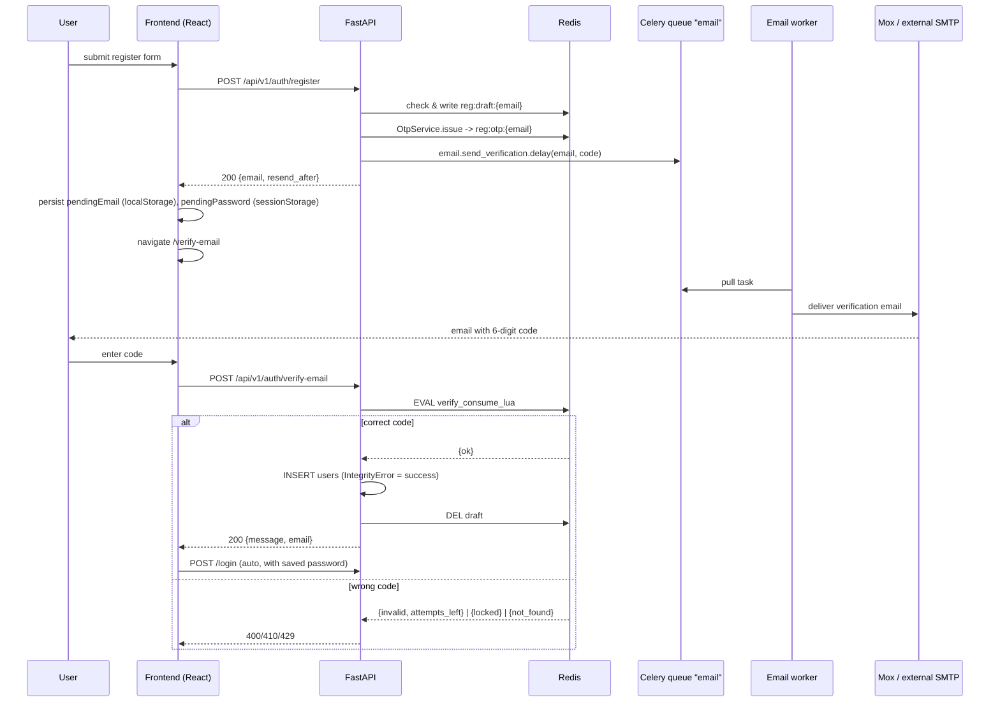

# Registration & Email Verification

Полное описание флоу самостоятельной регистрации студента в MedTest Platform.
Рассчитано на разработчиков, QA, SRE. Для преподавателей действует отдельный
механизм заявок: см. [TEACHER_REGISTRATION.md](TEACHER_REGISTRATION.md).

## Contents

1. [Overview](#1-overview)
2. [Architecture](#2-architecture)
3. [API Contract](#3-api-contract)
4. [OTP Policy](#4-otp-policy)
5. [Rate Limits](#5-rate-limits)
6. [Security Model](#6-security-model)
7. [Operations Runbook](#7-operations-runbook)
8. [Configuration Reference](#8-configuration-reference)
9. [Testing](#9-testing)
10. [Migration Notes](#10-migration-notes)
11. [Changelog](#11-changelog)

---

## 1. Overview

Студент регистрируется самостоятельно. Чтобы защититься от фиктивных
аккаунтов, платформа требует подтверждения email 6-значным одноразовым
кодом (OTP), который приходит на почту. Только после подтверждения в БД
появляется запись `users` и пользователь может войти.

Критичные качества системы:

- **Корректность под нагрузкой** — десятки параллельных регистраций не должны
  приводить к «неверному коду» (частый симптом).
- **Надёжность доставки** — если SMTP мигает, письмо в итоге должно прийти.
- **Устойчивость к brute-force** — перебор 10⁶ комбинаций блокируется за 5 попыток.
- **Устойчивость к перечислению** — нельзя определить, зарегистрирован ли email.

---

## 2. Architecture

### 2.1 Sequence



### 2.2 Component responsibilities (SRP)

| Module | Responsibility |
|---|---|
| `app.core.otp.OtpService` | Генерация / сравнение / consume OTP через Lua. Хранение — Redis hash с HMAC-SHA256. |
| `app.core.rate_limit` | slowapi-лимитер, общее хранилище в Redis (DB 4). |
| `app.services.email.EmailSender` | Абстракция доставки. Две реализации: `CeleryEmailSender` (prod), `SyncEmailSender` (dev/tests). |
| `app.services.email.templates` | Чистый рендер шаблонов, экранирование, валидация заголовков. |
| `app.services.email.smtp_backend` | Единственное место с `smtplib`. |
| `app.tasks.email_tasks` | Celery-задачи с autoretry и acks_late. |
| `app.api.v1.auth` | Контроллеры: register / verify-email / resend-verification / login / refresh. |
| `app.schemas.user.StudentRegisterSchema` | Pydantic-схема без поля `role` (extra=forbid). |

### 2.3 Redis key layout

| Key | Type | TTL | Purpose |
|---|---|---|---|
| `reg:draft:{lower(email)}` | string (JSON) | 900s | Черновик регистрации: email, password_hash, ФИО. |
| `reg:otp:{lower(email)}` | hash | 600s | `code_hash`, `attempts`, `resend_count`, `last_resend_at`, `issued_at`. |
| slowapi counters | varies | sliding | Rate-limit windows. Живут в DB 4. |

Почта нормализуется в lower() + strip() перед ключом — защита от обхода через
кейс/пробелы.

### 2.4 Почему именно так

- **Два ключа, а не один** — позволяет «рекэшировать» код без переписывания
  password_hash (и наоборот), что предотвращает атаку hijack (`§6.4`).
- **Lua verify_and_consume** — единственный атомарный способ сделать
  compare + attempts++ + del в Redis без TOCTOU.
- **Celery queue `email`** — отделена от долгих LLM-задач (`celery`), чтобы
  SMTP-мигание не забивало воркеров для оценки сабмишенов.
- **acks_late + task_reject_on_worker_lost** — при крэше воркера письмо
  гарантированно доставляется другим воркером.
- **slowapi с Redis storage** — лимиты переживают рестарт API, работают
  между несколькими uvicorn-воркерами.

---

## 3. API Contract

Все эндпоинты под префиксом `/api/v1/auth`. Тело запроса и ответа — JSON.

### 3.1 `POST /register`

Начало самостоятельной регистрации студента.

**Request body** (`StudentRegisterSchema`, `extra=forbid`):

```json
{
  "email": "student@example.com",
  "password": "Secret123",
  "last_name": "Иванов",
  "first_name": "Иван",
  "middle_name": "Иванович"
}
```

- `email` — RFC 5321 + базовая проверка через `EmailStr`; CRLF-инъекции 422.
- `password` — 6..100 символов.
- `middle_name` — optional.
- Поле `role` **не принимается**: 422 Unprocessable Entity.

**Responses** (все результаты имеют единую форму — defence против enumeration):

| Code | Причина | Body |
|---|---|---|
| 200 | Черновик создан или уже существовал; код возможно отправлен. | `{message, email, resend_after}` |
| 422 | Невалидные поля. | стандартный FastAPI |
| 429 | Лимит IP (`REGISTER_RATE_LIMIT_PER_IP`). | `{detail: "Too many requests..."}` |

Поле `resend_after` — количество секунд, через которое можно безопасно
вызвать `/resend-verification`.

### 3.2 `POST /verify-email`

**Request body**:

```json
{ "email": "student@example.com", "code": "123456" }
```

**Responses**:

| Code | Причина | Body |
|---|---|---|
| 200 | Email подтверждён, пользователь создан (или был создан параллельно). | `{message, email}` |
| 400 | Неверный код. | `{detail: "Invalid verification code. N attempts left."}` |
| 410 | Код истёк, не найден или драфт протух. | `{detail: "Verification code expired..."}` |
| 422 | Код не соответствует формату (6 цифр). | стандартный |
| 429 | Превышен лимит попыток ИЛИ IP-лимит. | `{detail: "Too many..."}` |

### 3.3 `POST /resend-verification`

**Request body**:

```json
{ "email": "student@example.com" }
```

**Responses**:

| Code | Причина | Body |
|---|---|---|
| 200 | Либо отправлен новый код, либо уже активный (cooldown). | `{message, email, resend_after}` |
| 429 | IP-лимит. | `{detail: "Too many requests..."}` |

Внутри endpoint использует `OtpService.issue()` с учётом `cooldown` и
`max_per_hour` — повторные вызовы внутри окна возвращают 200 без отправки
нового письма.

### 3.4 Таблица всех возможных `detail`

| Текст | Где | Назначение |
|---|---|---|
| `If this email is valid, a verification code has been sent.` | register / resend | Uniform response. |
| `Invalid verification code. N attempts left.` | verify | После неверной попытки. |
| `Too many incorrect attempts. Please register again.` | verify | 5+ неверных. |
| `Verification code expired or not found. Please request a new one.` | verify | TTL истёк / нет записи. |
| `Registration data expired. Please register again.` | verify | Draft истёк (редкость, OTP жив, draft нет). |
| `Too many requests. Please try again later.` | любой | slowapi. |
| `Email already verified` | verify | Пользователь уже есть в БД. |

---

## 4. OTP Policy

Все значения конфигурируемы через env (см. §8).

| Параметр | Дефолт | Обоснование |
|---|---|---|
| `OTP_LENGTH` | 6 | OWASP ASVS §6.2.2, NIST SP 800-63B §5.1.1.2 (≥ 6 digits). |
| `OTP_TTL_SECONDS` | 600 | 10 мин. Ниже чем в Google (10), Clerk (10), Auth0 (10). |
| `OTP_MAX_ATTEMPTS` | 5 | Достаточно для опечаток, мало для brute. |
| `OTP_RESEND_COOLDOWN_SECONDS` | 60 | Стандарт UX (Twilio, Auth0). |
| `OTP_MAX_RESENDS_PER_HOUR` | 5 | Защита от email bombing (§6.3). |
| `REGISTRATION_DRAFT_TTL_SECONDS` | 900 | Длиннее, чем OTP, чтобы resend работал. |

**Хранение:** code хранится как `hmac_sha256(SECRET_KEY, code)`. Даже при
leak Redis злоумышленник не восстанавливает код без SECRET_KEY.

**Counter persistence:** `attempts` сохраняется между resends — иначе resend
обнулял бы счётчик, и brute-force тривиально обходился. Это осознанное
решение; при необходимости можно поменять в `OtpService.issue`.

---

## 5. Rate Limits

Реализация: slowapi (Starlette + Redis storage DB 4). Ключ — прямой IP клиента
(`request.client.host`), не X-Forwarded-For (спуфинг невозможен).

| Endpoint | Default | Rationale |
|---|---|---|
| `/register` | `10/hour` per IP | Бот не создаст > 10 заявок/час. |
| `/resend-verification` | `20/hour` per IP | Больше, т.к. пользователь может кликать. |
| `/verify-email` | `30/minute` per IP | Верхняя граница для человека. |

При превышении — 429 с `Retry-After: 60`. Тело ответа не выдаёт, какой именно
лимит сработал (enumeration).

---

## 6. Security Model

### 6.1 Threat model (STRIDE, сокращённо)

| Угроза | Смягчение |
|---|---|
| **S**poofing (выдача за другого пользователя) | Подтверждение email обязательно; hijack-защита в `register` (см. §6.4). |
| **T**ampering (подделка кода) | HMAC-SHA256 + TTL + attempts cap. |
| **R**epudiation | audit-лог `register.*` в stdout (+ Prometheus метрики). |
| **I**nformation disclosure | Generic responses; dev_code только в ENV=development. |
| **D**oS (email bombing, SMTP flood) | slowapi + cooldown + hourly cap + Celery queue. |
| **E**levation of privilege (stu → admin) | `StudentRegisterSchema.extra=forbid`, роль захардкожена `Role.STUDENT` в эндпоинте. |

### 6.2 Атаки НЕ покрыты архитектурой

- **Физический доступ к Redis** — если злоумышленник имеет SHELL на
  Redis-ноде, он видит `code_hash` и может brute-force’ить его локально.
  Митигация: SECRET_KEY как источник энтропии + короткий TTL.
- **Компрометация SMTP-провайдера** — если mail-прокси читает письма, коды
  утекут. Митигация: TLS, отдельный сервер mox в изолированной сети.
- **Социальная инженерия пользователя** (отдаёт код добровольно) — вне скоупа.

### 6.3 Защита от email bombing

Двойной слой:

1. **cooldown 60s** — в `OtpService.issue`, даже при отсутствии slowapi.
2. **max 5 resends / hour** — жёсткий потолок.
3. **slowapi per-IP** — предотвращает скриптовую атаку с одного IP на разные email.

### 6.4 Hijacking pending registration

Сценарий: жертва начала регистрацию, атакующий знает её email и хочет
зарегистрироваться с этим email и своим паролем, чтобы затем угонять аккаунт.

Защита (см. `app/api/v1/auth.py:register`):

```
if existing_draft and not verify_password(new_password, existing_draft.password_hash):
    # не перезаписываем draft, отвечаем uniform 200, не отправляем новое письмо
    return RegistrationAccepted(...)
```

Атакующий не может вытеснить жертву, и жертва доверчиво завершит свою
регистрацию своим оригинальным кодом.

### 6.5 Логирование

- ENV=development: `logger.info("register.dev_code email=%s code=%s", ...)` — удобно для отладки.
- ENV=production: код **никогда** не попадает в логи. Даже errors логируются
  без тела запроса.
- Прод-логи НЕ должны содержать `password_hash`, bcrypt `$2b$...` строки,
  raw request body. Тесты `test_otp_not_logged_in_production` и
  `test_password_hash_never_in_response` это проверяют.

### 6.6 Хранение секретов

- `SECRET_KEY` — в секрет-сторе (Vault/Docker secrets); минимум 32 байта
  энтропии. Смена инвалидирует все активные OTP и refresh-токены.
- `SMTP_PASSWORD` — аналогично.
- `.env` — **не в git**. `.env.example` содержит только плейсхолдеры.

---

## 7. Operations Runbook

### 7.1 Деплой

```bash
# Единоразово: обновить зависимости
docker compose -f deployment/docker-compose.yml build backend

# Запуск (добавился celery_email_worker):
docker compose -f deployment/docker-compose.yml up -d \
    db redis mail minio backend celery_worker celery_email_worker nginx
```

Два Celery-воркера теперь обслуживают разные очереди:

- `celery_worker` → `--queues=celery` (LLM, оценка).
- `celery_email_worker` → `--queues=email` (короткие, быстрые).

### 7.2 Мониторинг

Рекомендуемые Prometheus метрики (добавить в будущем, сейчас только логи):

- `registration_requests_total{endpoint, outcome}`
- `otp_verification_failures_total{reason}`
- `email_queue_depth` — gauge, читается через Flower API или Redis `LLEN celery@email`.
- `rate_limit_rejections_total{endpoint}`

### 7.3 Alerting rules (пример Prometheus)

```yaml
- alert: EmailQueueBackpressure
  expr: email_queue_depth > 500
  for: 5m
  annotations: { summary: "Email queue > 500 items for 5m" }

- alert: OtpFailureSpike
  expr: rate(otp_verification_failures_total[5m]) > 10
  annotations: { summary: "OTP failure rate > 10/s — possible attack" }

- alert: EmailWorkerDown
  expr: up{job="celery_email_worker"} == 0
  for: 1m
```

### 7.4 Incident playbooks

#### Пользователи жалуются: «Неверный код»

1. Проверить версию фронта: `/verify-email` страница (не старый Dialog).
2. `docker compose logs -f backend | grep register.dev_code` (только в
   development) — код совпадает с тем, что пришёл в письме?
3. `redis-cli -n 0 TTL reg:otp:user@example.com` — ключ жив? Если < 60 сек —
   пользователь просто опоздал.
4. `redis-cli -n 0 HGETALL reg:otp:user@example.com` — `attempts` близко к
   `OTP_MAX_ATTEMPTS`? Возможно, у них сработал lockout.
5. Если массово — проверить `email_queue_depth` (следующий пункт).

#### Письма не приходят

1. `docker compose logs celery_email_worker --tail=100` — есть ли активность?
2. Проверить очередь: `redis-cli -n 1 LLEN email`. Если растёт — воркер не
   справляется, поднять `--concurrency`.
3. Проверить SMTP: `docker compose logs mail` (mox) или альтернативный SMTP.
4. `docker compose exec celery_email_worker celery -A app.tasks.celery_app inspect active`

#### Массовые 429

1. `redis-cli -n 4 KEYS 'LIMITS*'` — какие IP под лимитом.
2. Возможно, из-за NAT корпоративной сети. Вариант: временно повысить лимит
   в env и задеплоить.
3. Если целевая атака — заблокировать IP на уровне nginx/Cloudflare.

### 7.5 Локальная отладка

```bash
# Посмотреть все pending drafts:
docker compose exec redis redis-cli -n 0 KEYS 'reg:draft:*'

# Убить зависший draft:
docker compose exec redis redis-cli -n 0 DEL reg:draft:stuck@example.com reg:otp:stuck@example.com

# Смотреть dev-код:
docker compose logs -f backend | grep -E "(dev_code|Verification code)"
```

---

## 8. Configuration Reference

Все настройки в `backend/app/core/config.py`, переопределяются через env.

| Env var | Default | Тип | Range | Описание |
|---|---|---|---|---|
| `ENVIRONMENT` | `development` | str | development \| production | Влияет на логирование dev_code. |
| `SECRET_KEY` | dev-key | str | 32+ bytes | HMAC ключ для OTP. |
| `REDIS_URL` | redis://redis:6379/0 | str | — | Основной Redis (drafts, OTPs). |
| `RATE_LIMIT_STORAGE_URL` | derived | str | — | Отдельный DB для slowapi (по умолчанию DB 4). |
| `CELERY_BROKER_URL` | redis://redis:6379/1 | str | — | Celery broker. |
| `OTP_LENGTH` | 6 | int | 4–10 | Длина кода. |
| `OTP_TTL_SECONDS` | 600 | int | 60–3600 | TTL кода. |
| `OTP_MAX_ATTEMPTS` | 5 | int | 3–10 | Лимит попыток. |
| `OTP_RESEND_COOLDOWN_SECONDS` | 60 | int | 10–600 | Cooldown между resend. |
| `OTP_MAX_RESENDS_PER_HOUR` | 5 | int | 1–20 | Защита от email bombing. |
| `REGISTRATION_DRAFT_TTL_SECONDS` | 900 | int | ≥ OTP_TTL | Жизнь черновика. |
| `REGISTER_RATE_LIMIT_PER_IP` | `10/hour` | str | slowapi-format | Лимит регистрации. |
| `RESEND_RATE_LIMIT_PER_IP` | `20/hour` | str | — | Лимит resend. |
| `VERIFY_RATE_LIMIT_PER_IP` | `30/minute` | str | — | Лимит verify. |
| `EMAIL_TRANSPORT` | `celery` | str | celery \| sync | Стратегия отправки. |
| `SMTP_HOST` | None | str | — | Если пусто → dev-режим (печать в stdout). |
| `SMTP_PORT` | 587 | int | 25 / 465 / 587 | — |
| `SMTP_USER` / `SMTP_PASSWORD` | None | str | — | Креденшалы. |
| `SMTP_FROM` | None | str | EmailStr | От кого. |

---

## 9. Testing

Тесты живут в `backend/tests/registration/` (см. пирамиду в плане).

```bash
# Только быстрые юниты (≤ 10 сек)
pytest -m unit backend/tests/registration

# Интеграционные + security (требуется Redis/Postgres тест-контейнеры или локальные)
pytest -m "integration or security" backend/tests/registration

# Resilience (медленно, пропускает testcontainers-сценарии если не установлены)
pytest -m resilience backend/tests/registration

# Load (manual trigger)
locust -f backend/tests/load/locustfile_registration.py --host http://localhost:8000
```

E2E (Playwright): см. [frontend/e2e/README.md](../frontend/e2e/README.md).

Цели покрытия: `app.core.otp` — 100% строк, `app.api.v1.auth` — ≥ 90%.

---

## 10. Migration Notes

### Сценарии для студентов при накатывании апдейта

| Состояние студента на момент деплоя | Что произойдёт | Что делать |
|---|---|---|
| Верифицирован (есть запись в `users.is_verified=True`) | Ничего, логин работает как раньше. | — |
| Начал регистрацию, **НЕ верифицировался** (есть `pending_reg:{email}` в Redis DB 0) | Старый код из письма НЕ пройдёт verify-email (новый `/verify-email` не читает `pending_reg:*`) | **`--migrate-legacy`** сохранит password_hash + ФИО, студент просто жмёт «Отправить код повторно» на /verify-email и получает новый OTP. |
| Никогда не регистрировался | Обычная регистрация по новому флоу. | — |

### Три стратегии для deploy.sh

1. **`./deploy.sh --migrate-legacy`** (рекомендуется, если в Redis есть `pending_reg:*`)
   - Конвертирует `pending_reg:{email}` → `reg:draft:{email}`.
   - Сохраняет password_hash, last_name, first_name, middle_name.
   - Отбрасывает старый code (формат несовместим: plaintext vs HMAC, TTL 24h vs 10min).
   - Пользователь после деплоя открывает `/verify-email` → жмёт resend → получает новый код → вводит → готов.

2. **`./deploy.sh --cleanup-legacy`** (если в процессе регистрации никого нет или не жалко)
   - Удаляет `pending_reg:*` без миграции.
   - Студент должен полностью начать регистрацию заново.

3. **`./deploy.sh`** (без флагов)
   - Legacy-ключи остаются, истекут через TTL 24ч.
   - Данные не теряются, но пользователь 24 часа не может «продолжить» регистрацию — только начать заново.
   - Подходит, если нет активных регистраций на момент деплоя (ночью, в выходной).

### Планирование деплоя при массовом тестировании

Если скоро следующий раунд тестирования с теми же студентами:

1. Проверь количество `pending_reg:*` перед деплоем:
   ```bash
   docker exec medtest-redis redis-cli -n 0 --scan --pattern "pending_reg:*" | wc -l
   ```
2. Если > 0 и скоро потестят снова → используй **`./deploy.sh --migrate-legacy`**.
3. Пользователи в процессе увидят: «Срок действия кода истёк» (если попробуют старым кодом) → жмут resend → получают новый код мгновенно.
4. Опционально: разошли массовое оповещение «система обновлена, если вы начали регистрацию — нажмите resend на странице подтверждения».

### Технические моменты

1. **Breaking change для фронта**: `/register` теперь возвращает 200 даже при
   существующем email. Мобильные клиенты (если есть) должны это корректно обрабатывать.
2. **docker-compose.yml**: добавился `celery_email_worker` — требуется перезапуск.
3. **requirements.txt**: новые зависимости `slowapi==0.1.9`, `limits[redis]==3.7.0`.
   Пересобрать backend image.

### Откат

```bash
./deploy.sh --rollback
```

Миграция в одну сторону: после `--migrate-legacy` старый код не сможет читать новые
`reg:draft:*` ключи. Если откатываетесь на старый релиз — студентам с мигрированными
черновиками придётся заново начать регистрацию. Обычно не проблема.

---

## 11. Changelog

| Дата | Изменение |
|---|---|
| 2026-04-22 | Полный рефакторинг регистрации: OTP-сервис на Lua, Celery-очередь `email`, slowapi, отдельная страница `/verify-email`, устранено 11 дефектов из аудита. |
